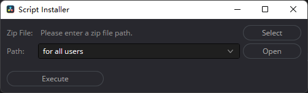
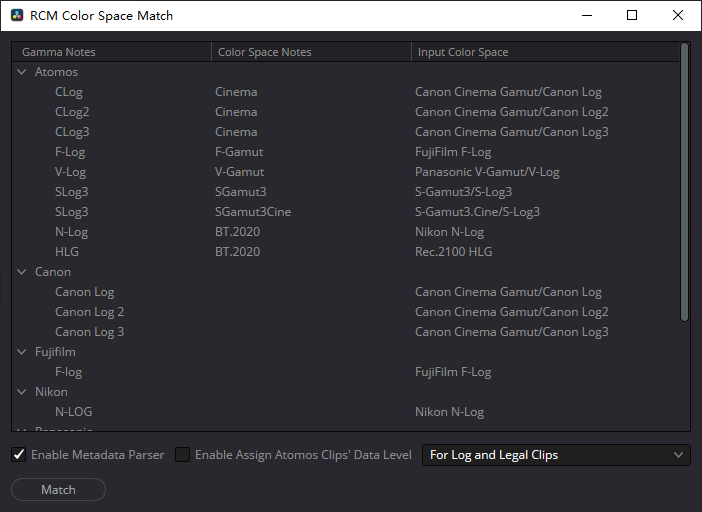
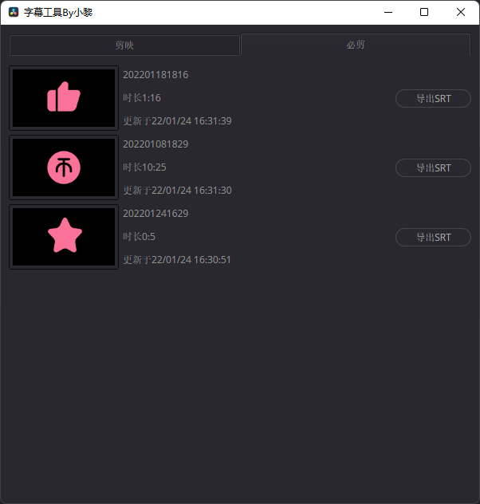
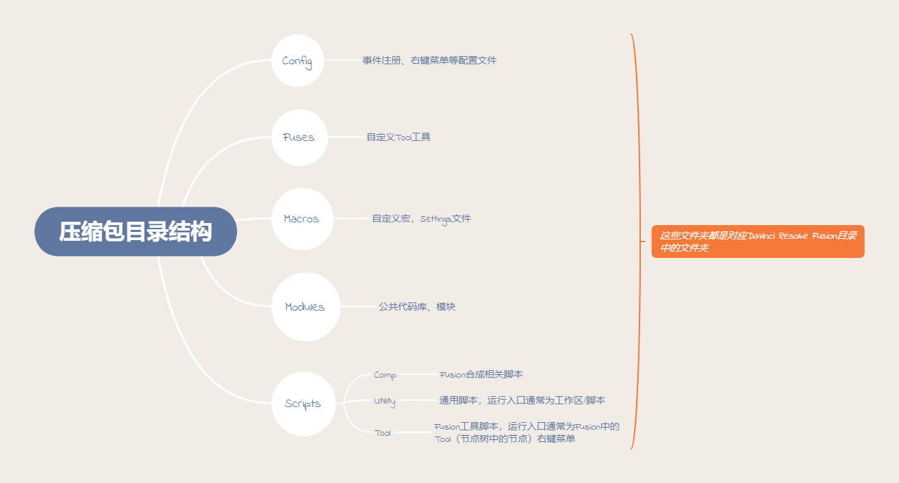

[English Version](README-EN.md)

## 支持范围
### 达芬奇版本
17+
### 操作系统
Windows Mac OS(Intel/Apple Silicon均可)

## 使用方法

### 前提条件

1. ~~安装Python3.6运行环境（部分脚本做了Python2.7兼容，支持Mac自带Python环境），达芬奇默认只识别通过安装包安装的环境以及Mac自带Python环境【如果只使用LUA脚本跳过此步骤】 
   Windows：[官网下载链接](https://www.python.org/ftp/python/3.6.8/python-3.6.8.exe)  
   Mac：[官网下载链接](https://www.python.org/ftp/python/3.6.8/python-3.6.8-macosx10.9.pkg) ，使用3.6版本的Python需要在Fusion设置中手动修改默认Python版本，默认为Python2.7，M1芯片的Mac不支持。~~ 
   2022/02/11更新：当前(从0.7.0)正式发布的脚本已经使用Lua重写过，无需额外安装Python环境了，后续版本开始暂不打包Python脚本，如果希望使用Python版本，请手动下载，后续默认也只提供Lua版本脚本，特殊情况会说明。

2. 使用Installer进行安装，无需再拷贝路径了，适配Windows&Mac 
   
   1) 将下载好的`Script Installer.lua`拖拽到Fusion界面中释放会出现UI界面或者复制粘贴代码到控制台运行 
   2) 文件选择框选择下载的压缩包 
   3) 下拉框选择`for all users` Or `for specfic user` 
   4) 点击执行
   5) 安装我的压缩后，后续可以通过点击【工作区/脚本/Script Installer】执行

### 如何使用

1. 元数据解析 
   在达芬奇内，打开 工作区->脚本->Metadata Parser 执行日志可以在 工作区->控制台 内查看

2. RCM色彩空间匹配 
   在达芬奇内，打开 工作区->脚本->RCM Color Space Match 执行日志可以在 工作区->控制台 内查看 
    
   a.视图中展示了RCM（色彩科学DaVinci YRGB Color Managed）色彩空间匹配规则 
   b.支持开启元数据解析，如果未单独解析元数据，需要勾选此选项，默认勾选 
   c.支持Atomos录机LOG素材以及Legal素材Data Level批量修改为Full，同时支持所有Atomos素材Data
   Level批量修改为Full（后者的操作你最好能弄明白原理是否需要使用此功能，错误操作会导致素材还原与预期不一致） 
   d.点击执行，将媒体池中所有元数据符合a中规则的片段，按照规则指定其input color space，Atomos素材按照指定规则修改其Data Level 
   e.如需使用使用无视图模式：编辑源代码,修改`gui_mode = 1`为`gui_mode = 0`，无视图模式默认开启元数据解析以及Atomos的LOG素材和Legal素材Data Level修改 
   f.佳能相机暂无法解析到拍摄使用的LOG格式，暂时无法自动匹配，如需批量匹配佳能素材可以使用智能媒体夹过滤佳能素材并全选设置对应输入色彩空间

3. ~~DRX文件管理~~【暂未正式推出】 
   在达芬奇内，打开 工作区->脚本->DRX Management 执行日志可以在 工作区->控制台 内查看 
   a.选择需要查找DRX文件的根目录 
   b.点击刷新按钮，更新目录以及递归目录所有DRX文件列表 
   c.如需使用无视图模式：编辑源代码，修改`gui_mode = 1`为`gui_mode = 0`

4. ~~调色工具~~【暂未正式推出】 
   在达芬奇内，打开 工作区->脚本->Color Grading Tool 执行日志可以在 工作区->控制台 内查看  
   I.调色拷贝工具 
   a.选择拷贝至所有时间线项/同一片段的时间线项/相同摄像机类型/相同摄像机序列号/相同关键词/相同输入色彩空间/相同片段色彩/相同旗标 
   b.选择是否指定调色版本，如果指定颜色版本不存在，将自动创建相应的调色版本，未指定则使用当前调色版本 
   c.点击"拷贝调色"执行  
   II.自定义调色 
   a.新增/修改选项（方案），提前设定 
   b.为单个方案新增/修改预定义调色方案，需要选择DRX文件名(由DRX Management自动生成)，匹配条件（条件支持所有、摄像机类型、摄像机序列号、关键词、输入色彩空间(RCM)
   、片段色彩、旗标），多条件时匹配规则为“同时满足”，如果需要满足“或”的场景，可以使用“添加条目”来实现 
   c.选择是否指定调色版本，如果指定颜色版本不存在，将自动创建相应的调色版本，未指定则使用当前调色版本 
   d.点击"保存配置"进行保存配置或"自定义调色"直接执行，执行会自动保存配置 

5. 字幕工具 
    
   a. 自动读取剪映，必剪项目，根据项目点击导出SRT即可 
   b. 将导出的srt文件手动导入到项目中，并创建字幕轨道 

## 文件说明

压缩包分为：全量版本以及仅Lua版本，前者脚本更全但是需要额外安装Python环境，后者无需安装Python环境使用达芬奇内置的Lua解释器，M1芯片MAC暂时不支持Python3.6，但是相对全量版本，脚本没有那么全面，如有需要我会尽力补全Lua版本脚本

### 脚本说明
<table>
  <tr>
    <th>文件夹</th>
    <th>文件名</th>
    <th>作用</th>
  </tr>
  <tr>
    <td rowspan="2">Config</td>
    <td>RCMColorSpaceMatchHotkey.fu</td>
    <td>Fusion快捷键注册，快速调色启动</td>
  </tr>
  <tr>
    <td>RCMFusionDisplayViewOn.fu</td>
    <td>Fusion中RCM色彩修正显示节点</td>
  </tr>
  <tr>
    <td rowspan="2">Macros</td>
    <td>RCM Color Space Display.setting</td>
    <td>RCM Fusion颜色偏移显示修正</td>
  </tr>
  <tr>
    <td>RCM Color Space Transform.setting</td>
    <td>RCM Fusion颜色偏移输出修正</td>
  </tr>
  <tr>
    <td>Scripts/Comp</td>
    <td>Fusion Hotkey Manager.lua</td>
    <td>Fusion快捷键管理</td>
  </tr>
  <tr>
    <td>Scripts/Tool</td>
    <td>RCM Color Shift Fix.lua</td>
    <td>RCM色彩修正Tool脚本</td>
  </tr>
  <tr>
    <td rowspan="5">Scripts/Utility</td>
    <td>Metadata Parser.lua</td>
    <td>元数据解析</td>
  </tr>
  <tr>
    <td>RCM Fusion Fix.lua</td>
    <td>RCM色彩空间色彩偏移批量修正</td>
  </tr>
  <tr>
    <td>RCM Color Space Match.lua</td>
    <td>RCM色彩空间匹配</td>
  </tr>
  <tr>
    <td>Script Installer.lua</td>
    <td>脚本安装助手</td>
  </tr>
  <tr>
    <td>Subtitle Tool.lua</td>
    <td>字幕工具</td>
  </tr>
</table>

附加的Python脚本
<table>
  <tr>
    <th>文件夹</th>
    <th>文件名</th>
    <th>作用</th>
  </tr>
  <tr>
    <td rowspan="4">Scripts/Utility</td>
    <td>Metadata parser.py</td>
    <td>元数据解析</td>
  </tr>
  <tr>
    <td>RCM Color Space Match.py</td>
    <td>RCM色彩空间匹配</td>
  </tr>
  <tr>
    <td>DRX Management.py</td>
    <td>DRX管理</td>
  </tr>
  <tr>
    <td>Color Grading Tool.py</td>
    <td>调色工具</td>
  </tr>
</table>

补充说明
* Metadata Parser(无视图脚本) 借助动态链接库解析视频文件元数据

* RCM Color Space Match（支持有、无视图模式） 
  1、使用RCM时支持通过视频文件元数据自动匹配输入色彩空间 

* DRX Management（支持有、无视图模式） 
  1、整理DRX文件，并按照目录拼接生成DRX文件显示名，供Color Grading Tool使用

* Color Grading Tool 
  1、单次调色可快速复制到时间线上其他项，支持全部或按照条件复制 
  2、基于DRX文件按条件匹配应用调色，支持配置持久化 （DRX文件是达芬奇能够识别的保存节点以及调色信息的文件）

* .dll .dylib后缀文件为动态链接库，源码使用Golang编写，参见另外一个项目

## 关于源码

1. ~~源码基于Python3.6开发，并不适配Mac OS自带的2.7版本，特别标注的除外~~
2. ~~Mac OS当前版本自带2.7以及高于3.6版本的Python，非M1芯片Mac建议安装Python3.6~~

### 源码贡献

* 如果你知道各种LOG格式对应的RCM的输入色彩空间，欢迎与我联系或者直接贡献源码。
* 如果你有各相机厂商的Tag标签定义或者元数据相关的白皮书什么的也欢迎联系我。

## 更新注意事项

### 色彩空间匹配规则

* 色彩空间匹配规则如果需要添加，可以与我联系，或者自己摸索代码依葫芦画瓢即可。

## Q&A

**Q: 全量脚本与LUA脚本怎么选？** 
A: ~~全量脚本包含Python以及Lua脚本，脚本更全，理论上Python脚本能实现的Lua脚本都能实现，实际上根据语言特点，开发难度上，Lua不占优势。由于个人能力问题，当前有些脚本只提供了Python脚本。
建议所有Windows用户使用全量版本，M1芯片的Mac也别折腾，当前（17.3版本）只用Lua版本的脚本。至于未来Python脚本是否都会迁移至Lua版本，视需求情况以及达芬奇版本更新情况再定。~~ 
从0.7.0开始默认只提供Lua版本，Python版本提供的功能均已使用Lua重写过，未发布的功能或希望使用Python版本的脚本可以手动下载。

**Q: Apple Silicon支持情况？** 
A: ~~当前达芬奇版本17.4.3支持的Python版本为3.6，这个版本无法安装在M1的MAC上，至于Lua脚本，单纯的Lua脚本应该是支持的，个人没有相应环境无法测试验证，部分依赖动态链接库的脚本，理论上可以做到支持，
因为没有开发验证环境，并没有去做相应版本编译构建，所以也不支持。~~ 
支持

**Q: 为何没有提供中文界面？** 
A: emmm，本来是要做国际化的，支持中英文版本的，与达芬奇内语言设置同步，找到了对应的API`fusion:GetPrefs("Global.UserInterface.Language")`
，切换中英文无法正确获得语言设置，国际化工作暂时搁置。界面中都是简单英文单词，对各位难度应该不大。 07-02 Update:
Win系统下%appdata%目录下`%appdata%\Blackmagic Design\DaVinci Resolve\Preferences\config.user.xml`中能够读取到系统语言设置
字幕工具为纯中文界面

**Q: 喂！有BUG啊，如何反馈？** 
A: 在你能找到我的方式内联系我，或者按照规范提交ISSUE。

